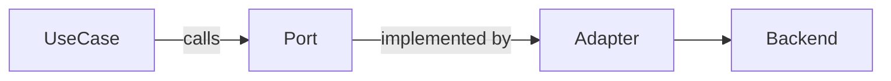
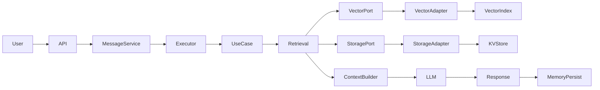
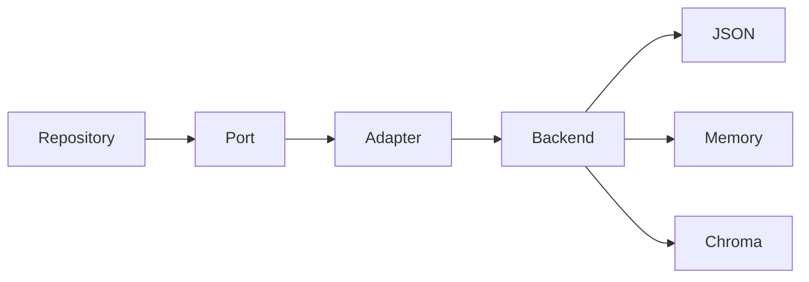
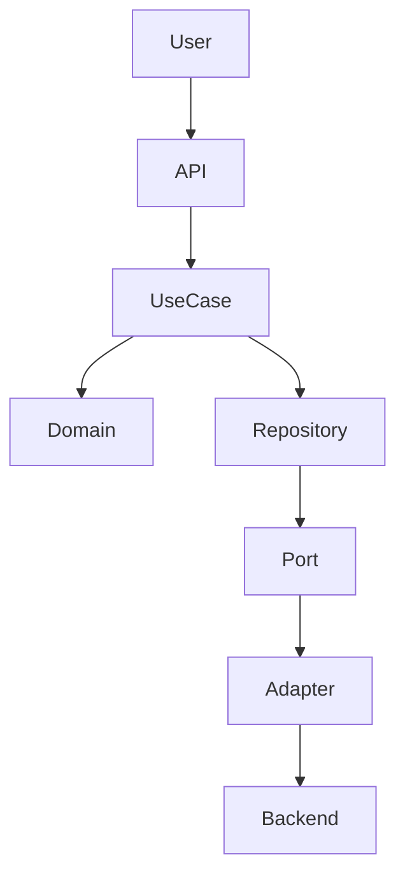

# 🏛️ Architecture Specification — System Design Blueprint

Version: 2.0  
Status: **IA-FIRST DESIGNED & SYNCHRONIZED WITH CODE** (April 19, 2026)

---

## 📋 IA-FIRST DESIGN STRUCTURE

> **This specification is written for both machine-parsing and human reading.**
>
> **Guarantees for automation:**
> - H1: Title, H2: Major sections, H3: Subsections (predictable hierarchy)
> - Code blocks use fence markers (```language)
> - Constraints use structured markers: ✅ MUST, ❌ NEVER, ⚠️ WHEN
> - Cross-references use markdown links: `[text](path)`
> - Tables use standard markdown format
> - Lists use consistent indentation (- or •)
> - No Portuguese, no mixed languages (English only)

**For readers:** Scan emoji markers (🎯, 🔴, 🟢, 📍) for quick context.

---

# 🎯 PURPOSE

This document formalizes the system architecture as a **normative specification** (not guidance).

It is binding for:
- Developers implementing features
- AI agents generating code
- Code generators and tools
- Architecture reviewers

All code MUST conform to this specification. Specification is synchronized with code.

**Reference:** Compliance details in [ADR-001](../decisions/ADR-001.md) (8-layer clean architecture)

---

# ✅ IMPLEMENTATION STATUS

**Current State:** All major architectural decisions have been implemented and synchronized with codebase.

| Component | Status | Location |
|-----------|--------|----------|
| Domain Layer | ✅ Active | `src/domain/` |
| Application UseCases | ✅ Consolidated | `src/application/usecases/` |
| Application Runtime | ✅ Consolidated | `src/application/runtime/` |
| Ports | ✅ Defined | `src/application/ports/` |
| Infrastructure Adapters | ✅ Active | `src/infrastructure/adapters/` |
| Interface (API) | ✅ Active | `src/interfaces/api/` |
| Interface (Discord) | ✅ Consolidated | `src/interfaces/discord/` |
| Interface (CLI) | ✅ Active | `src/interfaces/cli/` |
| DI Modules | ✅ Active | `src/modules/` |

**Latest Changes (April 18, 2026):**
- ✅ UseCases consolidated in `application/usecases/`
- ✅ Runtime consolidated in `application/runtime/`
- ✅ Discord moved from `frameworks/discord/` to `interfaces/discord/`
- ✅ Application structure cleaned (removed `context/`, `state/`)

For detailed implementation history: see [design-decisions.md](./design-decisions.md)

---

# 📜 SOURCE OF TRUTH HIERARCHY

This spec extends and enforces:
1. /docs/ia/specs/constitution.md (immutable principles)
2. /docs/ia/ai-rules.md (execution protocols)
3. /docs/ia/specs/_shared/testing.md (testing strategies)

In case of conflict:
👉 Constitution prevails

---

# 🧱 CORE ARCHITECTURE

## Pattern

- Clean Architecture (mandatory)
- Ports & Adapters — Hexagonal (mandatory)
- No framework coupling in domain/application

---

## Layers

```mermaid
flowchart TB
    API[Interface Layer (FastAPI / Discord)]
    APP[Application Layer (UseCases)]
    DOMAIN[Domain Layer]
    PORTS[Ports (Interfaces)]
    ADAPTERS[Adapters]
    INFRA[Infrastructure (Backends)]

    API --> APP
    APP --> DOMAIN
    APP --> PORTS
    PORTS --> ADAPTERS
    ADAPTERS --> INFRA
```

---

## Rules

- Domain MUST NOT depend on any other layer
- Application MUST depend only on Domain + Ports
- Infrastructure MUST implement Ports
- Interface MUST NOT contain business logic

---

# 🔌 PORTS & ADAPTERS (MANDATORY)

## Flow



---

## Rules

- ALL infra access MUST go through Ports
- Adapters MUST NOT be accessed directly
- Ports MUST be async
- Ports MUST NOT contain logic

---

## ❌ PROHIBITED

- Direct adapter usage
- Infra imports in domain/application
- Business logic in adapters

---

# ⚙️ ASYNC MODEL

## Rules

- System is fully async
- All I/O must use async/await

## ❌ PROHIBITED

- Blocking event loop
- Sync I/O in core layers

---

# 🧠 RAG PIPELINE

## Enforced Flow



---

## Rules

- Vector MUST NOT be source of truth
- Storage MUST provide authoritative data
- Retrieval MUST use scoping

---

# 🗄️ STORAGE ARCHITECTURE



---

## Rules

- Storage MUST be abstracted
- Backends MUST be interchangeable
- No direct DB/file access

---

# ⚫ VECTOR INDEX — Black Box Rule

## Definition

Vector Index is a **semantic search system** used for retrieval. It is:
- ✅ Useful for finding similar data
- ✅ Fast for large datasets
- ❌ NOT a source of truth
- ❌ NOT authoritative
- ❌ NOT suitable for business logic

## Access Pattern

Must be accessed ONLY via **VectorReaderPort** (for queries) and **VectorWriterPort** (for indexing). Never direct adapter/backend imports.

```python
# ✅ CORRECT - Using ports via DI
class RetrieveContextUseCase:
    def __init__(self, vector_reader: VectorReaderPort):
        self.vector_reader = vector_reader
    
    async def execute(self, query: str):
        results = await self.vector_reader.retrieve(query)
        return results

# ✅ CORRECT - Initialization via factory pattern
from bootstrap.vector.factory import VectorIndexFactory

reader = VectorIndexFactory.create_reader()
writer = VectorIndexFactory.create_writer()
container.register(VectorReaderPort, reader)
container.register(VectorWriterPort, writer)

# ❌ WRONG - Direct backend coupling (VIOLATES ARCH)
from infrastructure.adapters.vector.chroma_adapter import ChromaVectorDB
db = ChromaVectorDB()  # VIOLATES: Tightly coupled to ChromaDB
results = db.query(query)

# ❌ WRONG - Direct adapter instantiation (VIOLATES ARCH)
vector_db = ChromaVectorDB(persist_directory="/path")
service = VectorReaderService(vector_db)
# Should use factory instead!
```

**[MARKER: Vector Implementation Rule]** FACTORY PATTERN IS MANDATORY
- Reason: Implements black-box principle - application never knows actual backend
- Implementation: `bootstrap/vector/factory.py` creates ports
- Phase 1 Requirement: This prevents ChromaDB coupling in container_builder.py

## Rules (MANDATORY)

1. **Never couple implementation details - USE FACTORY PATTERN**
   - ❌ Do NOT directly import ChromaVectorDB or any vector backend
   - ❌ Do NOT instantiate adapters in container_builder
   - ✅ DO use factory pattern for instantiation
   - ✅ DO inject ports only, never adapters
   - **[MARKER: Factory Requirement]** Encapsulates backend selection (ChromaDB, Qdrant, etc.)

2. **Treat as black box in tests**
   - Mock VectorReaderPort/VectorWriterPort (never the implementation)
   - Test that ports are called, not HOW they rank
   - See [testing.md](./testing.md) for patterns

3. **Separate read and write concerns**
   - **VectorReaderPort**: Query/retrieval operations only (read-only)
   - **VectorWriterPort**: Index/bulk insert operations only (write-only)
   - Rationale: Enables read-only cache layers, disabled-write deployments
   - **[MARKER: Port Separation]** Confirmed intentional design (not to be merged)

3. **Never use for authority**
   - Always validate results against KV storage
   - Use as "suggestion" only
   - Cross-check critical data

4. **Fallback handling is mandatory**
   - Code must work if vector fails
   - Have graceful degradation
   - Log retrieval issues

## Example: Correct Usage

```python
async def retrieve_context_with_fallback(self, query: str) -> List[Document]:
    # Try vector index
    try:
        vector_results = await self.vector_port.retrieve(query, limit=5)
    except VectorIndexError:
        vector_results = []  # Fallback to empty
    
    if not vector_results:
        # Fallback to keyword search
        vector_results = await self.kv_port.search_by_keyword(query)
    
    # Validate against source of truth (KV storage)
    validated = []
    for result in vector_results:
        doc = await self.kv_port.get(result.id)  # Double-check in KV
        if doc:
            validated.append(doc)
    
    return validated
```

## Testing

See [testing.md — Vector Index Testing](./testing.md#-vector-index-testing)

---

## ❌ PROHIBITED

- Using vector as source of truth
- Coupling vector with storage logic

---

# 🔄 DATA FLOW



---

# 🚫 ANTI-PATTERNS

- Direct infrastructure access
- Skipping layers
- Mixing KV and vector
- Blocking async flow

---

# 🔑 KEY IMPLEMENTATION DECISIONS

## 1. Application Layer Organization

**Decision:** Keep all UseCases in single `application/usecases/` folder (not per-feature subfolders)

**Rationale:**
- Single import location for all use cases
- Easy to discover all capabilities
- Per-feature separation at port/adapter level (not usecase level)
- Consistent naming: `<verb><entity>_usecase.py`

**Status:** ✅ Implemented

---

## 2. Runtime Consolidation

**Decision:** Consolidate all runtime execution logic in `application/runtime/` (not at root `src/runtime/`)

**Rationale:**
- Runtime is application-level concern (orchestration)
- Removes redundancy between root-level and application-level runtime
- Single source of truth for campaign/app state management

**Structure:**
- `app_runtime.py` — Global app state & DI container
- `campaign_manager.py` — Multi-campaign orchestration
- `campaign_runtime.py` — Per-campaign execution context

**Status:** ✅ Implemented

---

## 3. Interface Entry Points Consolidation

**Decision:** All entry points (API, Discord, CLI) in `interfaces/` (not mixed with frameworks/)

**Rationale:**
- Clear separation: business logic vs. entry points
- Frameworks only used for HTTP framework selection (FastAPI), not as organizational principle
- Discord bot is interface, not framework

**Status:** ✅ Implemented (Discord moved to `interfaces/discord/`)

---

## 4. Ports are Always Async

**Decision:** All Ports MUST have async methods (even for local operations)

**Rationale:**
- Consistent async model throughout application
- Allows adapters to switch between sync/async backends seamlessly
- Future-proof for non-blocking I/O

**Example:**
```python
class NarrativeRepositoryPort(Protocol):
    async def get(self, id: str) -> Narrative: ...
    async def save(self, narrative: Narrative) -> None: ...
```

**Status:** ✅ Implemented

---

## 5. Vector Index as Black Box

**Decision:** Vector Index treated as non-authoritative retrieval only

**Rationale:**
- Semantic search is best-effort (ranking is opaque)
- Storage (KV) is source of truth
- Retrieval failure must not break application

**Consequence:** Always validate vector results against KV storage

**Status:** ✅ Implemented + Documented

---

## 6. No Test-Specific Production Code

**Decision:** Production code MUST NOT have test-specific branches (e.g., `if TEST_MODE`)

**Rationale:**
- Tests should validate actual behavior, not modified behavior
- Production code stays clean
- Dependencies should be injected, not detected

**Enforcement:** See [testing.md](./testing.md)

**Status:** ✅ Implemented

---

## 7. Runtime Components (NEW - April 2026)

**Decision:** Separate AppRuntime and RuntimeModule for lifecycle management

### AppRuntime (Layer 5: Composition)
- **Purpose:** Orchestrates application startup, shutdown, health checks
- **Responsibilities:**
  - Coordinates component lifecycle (start/shutdown in correct order)
  - Manages EventBus, Executor, AsyncComponentRegistry
  - Provides health_check() status
- **Pattern:** Singleton, non-blocking async operations
- **Location:** `application/runtime/app_runtime.py`
- **Usage:** Called from bootstrap during startup/shutdown

### RuntimeModule (Layer 5: Composition)
- **Purpose:** DI module that configures runtime components
- **Responsibilities:**
  - Registers ExecutorPort implementation
  - Registers EventBusPort implementation
  - Configures async component lifecycle
- **Pattern:** Standard DI module pattern
- **Location:** `modules/runtime_module.py`
- **Usage:** Container invokes during initialization

**[MARKER: Component Layers]** Clarification needed:
- AppRuntime: Application layer component (orchestration)
- RuntimeModule: Bootstrap/DI composition layer
- EventBusPort: Port (application layer)
- ExecutorPort: Port (application layer)

**Status:** 🔄 Planned (Phase 1 implementation April 2026)

---

## 8. Campaign Scoping (NEW - April 2026)

**Decision:** Thread-local per-campaign container isolation (ADR-005 Level 2)

**Components:**
- **CampaignScopedContainer:** Singleton managing campaign containers
- **Thread-Local Storage:** Prevents concurrent campaign state leakage
- **Factory Pattern:** Creates isolated containers per campaign

**Rules:**
- Each campaign gets isolated container with campaign-specific stores
- No cross-campaign state sharing (except via Ports)
- Context manager handles automatic cleanup
- Enables true concurrent campaign execution

**Example:**
```python
# Automatic isolation and cleanup
with CampaignScopedContainer.instance().campaign_scope("campaign_123"):
    service = container.resolve(NarrativeServicePort)
    await service.execute(...)
# Cleanup happens automatically
```

**[MARKER: Nesting Support]** Decision needed:
- Should nested campaign_scope() calls be allowed?
- Recommendation: No nesting (simpler, prevents confusion)
- Alternative: Support nesting with stack-based context

**Status:** 🔄 Planned (Phase 2B implementation April 2026)

---

## 9. Multi-Level Scoping (NEW - April 2026)

**Decision:** Support hierarchical scoping for world → genre → campaign memory levels

**Rationale:**
- World baseline (canonical) shared across all campaigns
- Genre cache (shared) reusable across campaigns in same genre
- Campaign memory (dynamic) isolated to specific campaign
- Enables narrative echo system and cache reuse

**Hierarchy:**

```
World Scope (Canonical Memory)
  ├─ Immutable baseline facts
  ├─ Shared across ALL genres/campaigns
  └─ Source of truth
  
Genre Scope (Shared Cache)
  ├─ Reusable templates and cached memories
  ├─ Shared across campaigns in SAME genre
  └─ Can be invalidated (event-based)
  
Campaign Scope (Dynamic Memory)
  ├─ Individual campaign state
  ├─ Isolated from other campaigns
  └─ Mutable (changes with gameplay)
```

**Usage Pattern:**

```python
# Nested scoping for full cascade
@contextmanager
def nested_scopes(world_id: str, genre_id: str, campaign_id: str):
    with WorldScope(world_id):
        with GenreScope(genre_id):
            with CampaignScope(campaign_id):
                yield  # Full hierarchy accessible

# Usage
with nested_scopes("cyberpunk_2087", "cyberpunk", "campaign_123"):
    # Can resolve:
    # - campaign_123 services (isolated)
    # - cyberpunk genre services (shared cache)
    # - cyberpunk_2087 world services (canonical)
    service = container.resolve(NarrativeServicePort)
    
    # Service can:
    # 1. Get campaign-specific memory
    # 2. Query genre cache (semantic search)
    # 3. Access world baseline facts
    # 4. Retrieve echoes from previous campaigns
    context = await service.get_full_context()
```

**Storage Hierarchy:**

```
data/
  world_cyberpunk_2087/
    canonical/              ← Immutable world baseline
      fact_001.json
      fact_002.json
    genre_cyberpunk/        ← Shared genre cache
      shared_cache/
        memory_cache_001.json
      campaign_001/         ← Campaign 1 (isolated)
        memory_001.json
      campaign_002/         ← Campaign 2 (isolated)
        memory_001.json
      campaign_003/         ← Campaign 3 can access campaigns 1-2 via echoes
        memory_001.json
```

**[MARKER: Business Rules Integration]**
- See business-rules.md for memory hierarchy semantics
- Campaign isolation + echo system requires this scoping model
- Direct impact on CampaignScopedContainer design

**Status:** 🔄 Planned (Phase 2B/3 implementation)

---

# 🧠 Final Principle

👉 Architecture is NOT negotiable  
👉 All components MUST conform to this specification  


## 🧠 Runtime Awareness

Architecture is guided by dynamic state located at:

/runtime/execution_state.md

Rules:
- Specs define INTENTION
- Runtime defines CURRENT REALITY
- In case of conflict → runtime wins

---

## 🧵 Thread Model

Each critical domain can have its own thread:

/runtime/threads/*.md

Objective:
- Cognitive isolation
- Parallel execution with AI

---

# 📚 RELATED SPECIFICATIONS

- [testing.md](./testing.md) — Testing strategies and best practices
- [feature-checklist.md](./feature-checklist.md) — Step-by-step implementation
- [feature-template.md](./feature-template.md) — Complete working example
- [conventions.md](./conventions.md) — Naming and style rules
- [contracts.md](./contracts.md) — Port interface definitions
- [project-structure.md](./project-structure.md) — Folder organization
